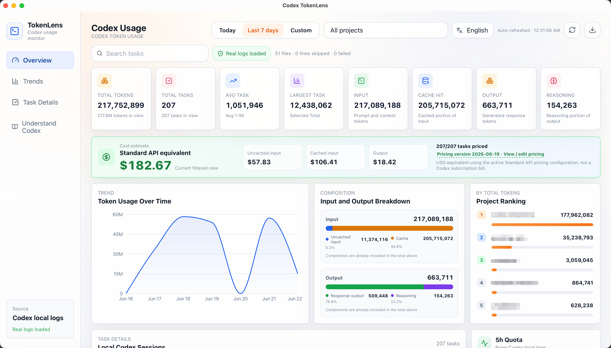
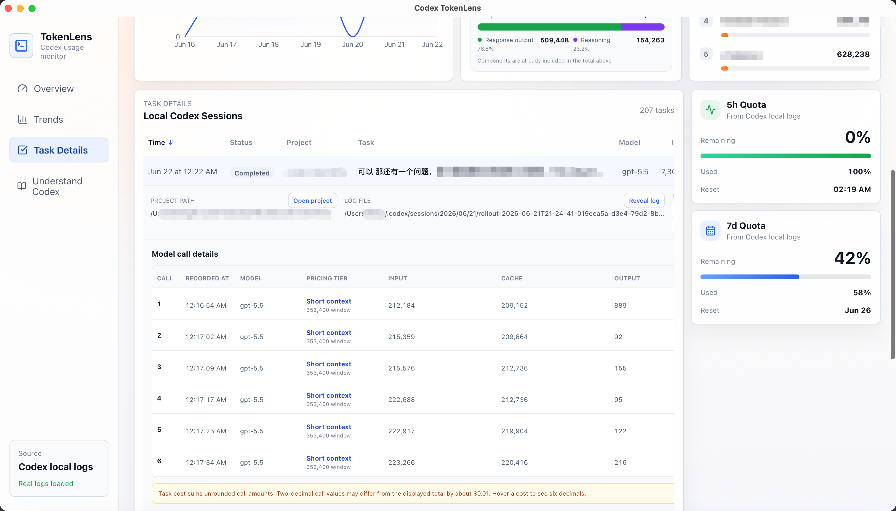
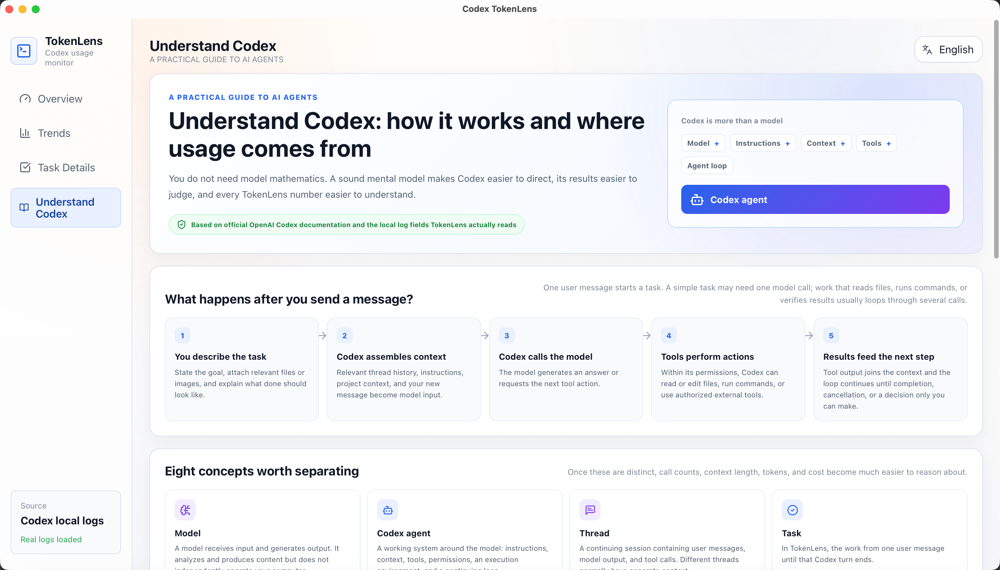
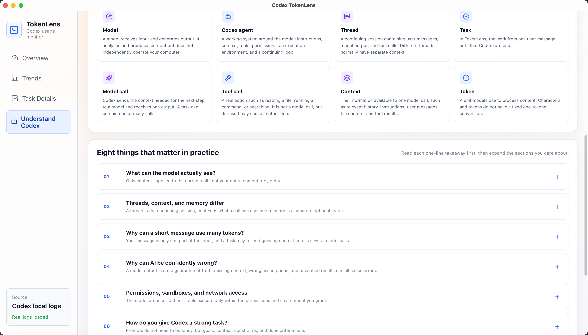

<div align="center">

# Codex TokenLens

**A local-first desktop dashboard for understanding Codex token usage.**

[English](README.md) | [简体中文](README.zh-CN.md)

[](https://github.com/LT1130/codex-tokenlens/actions/workflows/check.yml)
[](LICENSE)
[](https://github.com/LT1130/codex-tokenlens/releases)

</div>

Codex TokenLens reads Codex JSONL session logs on your computer and turns them into task-, project-, and time-based usage insights. It is designed to stay lightweight and local: there is no server, account system, telemetry, cloud sync, or log upload.

> Codex TokenLens is an independent open-source project and is not affiliated with or endorsed by OpenAI.

## Screenshots



<table>
  <tr>
    <td width="50%" align="center">
      
      <br />
      <sub>Task details and model call breakdown</sub>
    </td>
    <td width="50%" align="center">
      
      <br />
      <sub>Understanding Codex learning center</sub>
    </td>
  </tr>
</table>

<details>
  <summary>More from the Understanding Codex guide</summary>
  <br />
  
</details>

## Highlights

- Today, last 7 days, and custom date range views
- Token trends, input/output composition, and project rankings
- Search, project filtering, sortable task details, expansion, and pagination
- Input, output, cached input, and reasoning output breakdowns
- Per-call model, context tier, token usage, and Standard API equivalent cost
- Local, versioned pricing catalog with user-defined model pricing
- Primary and secondary Codex rate-limit windows
- CSV export with local timestamps and Excel-compatible UTF-8
- Incremental JSONL parsing, filesystem watching, and 15-second refreshes
- Diagnostics for malformed lines, failed files, and in-progress tasks
- English and Simplified Chinese interface
- A bilingual “Understanding Codex” learning center

## Privacy and data boundaries

Codex TokenLens reads from `CODEX_HOME` when it is set. Otherwise it scans:

```text
~/.codex/sessions
~/.codex/archived_sessions
```

All parsing and analysis happens locally. The app does not upload session logs or usage data. Browser development mode cannot access the Tauri backend and therefore uses bundled sample data; sample data is never presented as real desktop usage.

## Token and cost accounting

Total tokens are always calculated as `input + output`. Cached input is part of input, and reasoning output is part of output, so neither is counted twice.

Codex reports cumulative usage within a thread. TokenLens calculates each task from the thread high-water mark minus the baseline before that task, avoiding both missed tool-loop calls and double counting across tasks.

Standard API equivalent cost is estimated as:

```text
(input - cached input) × input price
+ cached input × cached input price
+ output × output price
```

Reasoning output is already included in output and is not charged again. Estimates use the local pricing catalog and do not represent a Codex subscription bill. Unknown models are clearly marked instead of being assigned a guessed price.

## Install on macOS

The current macOS release target is Apple Silicon.

1. Download the DMG from [GitHub Releases](https://github.com/LT1130/codex-tokenlens/releases).
2. Compare its SHA-256 value with the checksum shown on the release page.
3. Drag **Codex TokenLens** into `Applications`.

The free release is ad-hoc signed but not Apple-notarized. On first launch, macOS may block it because the developer cannot be verified. After confirming the download and checksum, Control-click the app in Finder and choose **Open**, or follow [Apple’s instructions](https://support.apple.com/guide/mac-help/mh40616/mac) to allow this individual app under **System Settings → Privacy & Security**. You do not need to disable Gatekeeper globally.

## Install on Windows

The current Windows release target is x64.

1. Download the `.exe` installer from [GitHub Releases](https://github.com/LT1130/codex-tokenlens/releases).
2. Compare its SHA-256 value with the checksum shown on the release page.
3. Run the installer and follow the setup steps.

The Windows installer is currently unsigned, so Windows may show a SmartScreen or unknown publisher warning on first launch. After confirming the download source and checksum, you can choose to continue for this app specifically.

## Development

### Requirements

- Node.js 22 or later
- Rust and Cargo
- Xcode Command Line Tools on macOS
- Microsoft C++ Build Tools with `Desktop development with C++` on Windows
- Microsoft Edge WebView2 on Windows (usually already installed on supported systems)

### Run the desktop app from source

If you only want to run Codex TokenLens from source, choose either repository mirror, then run the remaining commands:

GitHub:

```bash
git clone https://github.com/LT1130/codex-tokenlens.git
```

Gitee (China mirror):

```bash
git clone https://gitee.com/li_tongyiyi/codex-tokenlens.git
```

Then:

```bash
cd codex-tokenlens
npm install
npm run desktop
```

This launches the Tauri desktop app and reads real Codex logs from your computer. Playwright and the validation commands below are not required for normal use.

For frontend development, you can optionally run the browser UI with sample data:

```bash
npm run dev
```

Browser development runs at `http://127.0.0.1:5173/`. Do not start another Vite process while `npm run desktop` is using that port.

### Contribute and validate changes

The following commands are for contributors who modify the code. You do not need to run them just to use the app.

```bash
npm test
npm run build
npm run test:e2e
cargo test --manifest-path src-tauri/Cargo.toml
cargo fmt --manifest-path src-tauri/Cargo.toml --check
cargo clippy --manifest-path src-tauri/Cargo.toml --all-targets -- -D warnings
cargo check --manifest-path src-tauri/Cargo.toml
```

- `npm test` checks frontend calculations, filters, CSV export, and pricing logic.
- `npm run build` type-checks and builds the frontend.
- `npm run test:e2e` uses Playwright to simulate key UI flows in a browser.
- The Cargo commands test, format-check, lint, and compile-check the Rust backend.

Only if you want to run `npm run test:e2e`, install Playwright’s dedicated Chromium browser once:

```bash
npx playwright install chromium
```

### Build the desktop package

```bash
npm run desktop:build
```

Bundles are written to `src-tauri/target/release/bundle/`.

- macOS installers are written under `src-tauri/target/release/bundle/dmg/`
- Windows installers are written under `src-tauri/target/release/bundle/nsis/` and `src-tauri/target/release/bundle/msi/`

## Architecture

```text
Codex JSONL logs
  → Rust/Tauri filesystem access and fault-tolerant parsing
  → typed Tauri commands
  → React filtering, aggregation, and visualization
```

- `src-tauri/src/`: local scanning, incremental JSONL parsing, CSV saving, and OS integration
- `src/app/`: page state, filtering, aggregation, and export orchestration
- `src/components/`: dashboard, charts, pricing settings, guide, and task details
- `src/data/`: data contracts, loading, pricing, filters, CSV generation, and sample data
- `src/i18n/`: English and Simplified Chinese UI and learning content
- `e2e/`: Playwright browser smoke tests

macOS Apple Silicon and Windows x64 have been validated for desktop packaging and basic app launch. Linux code paths exist, but Linux packaging and full desktop behavior still require testing.

## License

[MIT](LICENSE)
