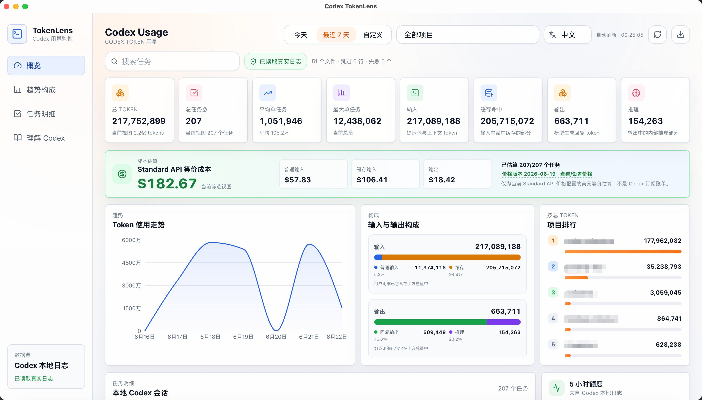
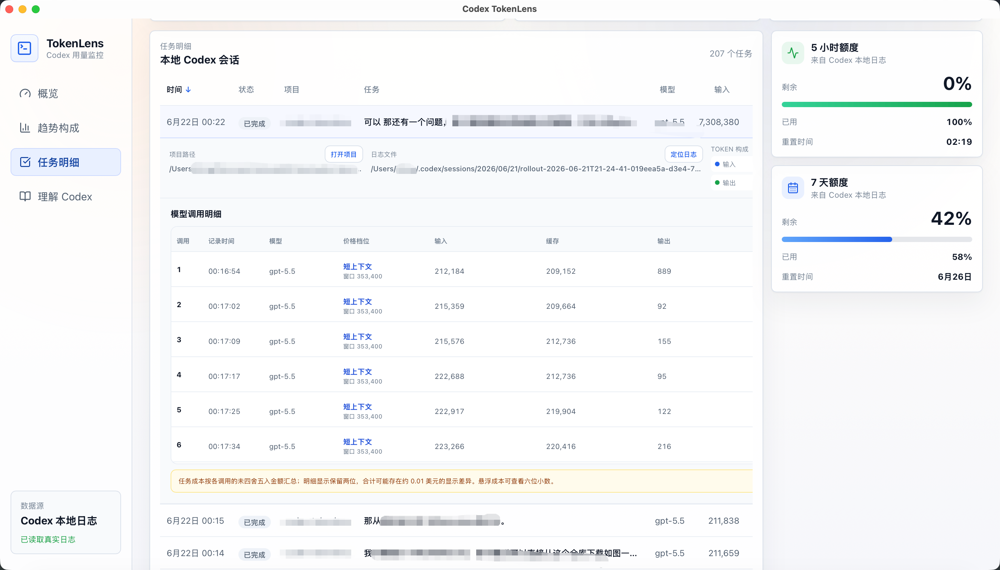
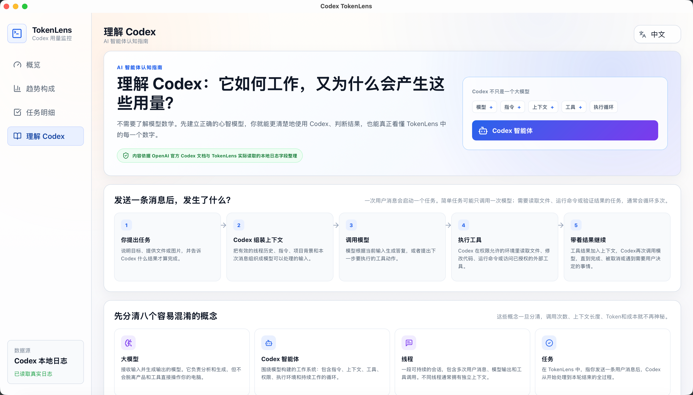
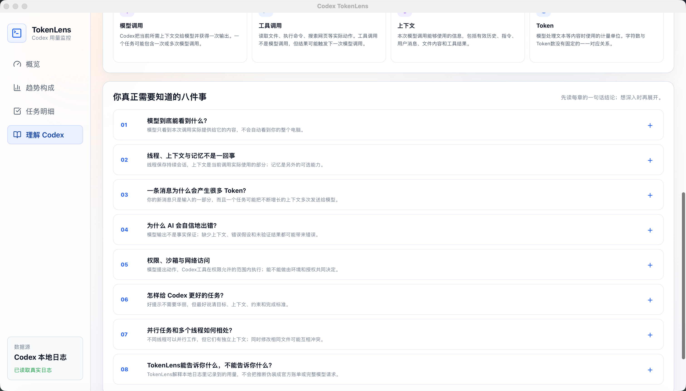

<div align="center">

# Codex TokenLens

**一个帮助你理解 Codex Token 使用情况的本地优先桌面仪表盘。**

[English](README.md) | [简体中文](README.zh-CN.md)

[](https://github.com/LT1130/codex-tokenlens/actions/workflows/check.yml)
[](LICENSE)
[](https://github.com/LT1130/codex-tokenlens/releases)

</div>

Codex TokenLens 读取电脑上的 Codex JSONL 会话日志，并将其整理为按任务、项目和时间划分的用量洞察。它坚持轻量与本地优先：没有服务端、账户体系、遥测、云同步，也不会上传日志。

> Codex TokenLens 是独立的开源项目，与 OpenAI 不存在隶属或官方背书关系。

## 界面预览



<table>
  <tr>
    <td width="50%" align="center">
      
      <br />
      <sub>任务详情与模型调用明细</sub>
    </td>
    <td width="50%" align="center">
      
      <br />
      <sub>理解 Codex 学习中心</sub>
    </td>
  </tr>
</table>

<details>
  <summary>查看更多“理解 Codex”内容</summary>
  <br />
  
</details>

## 主要能力

- 今日、最近 7 天和自定义日期范围
- Token 趋势、输入输出构成与项目排行
- 搜索、项目筛选、任务排序、展开和分页
- Input、output、cached input 与 reasoning output 明细
- 逐次调用的模型、上下文档位、Token 和 Standard API 等价成本
- 本地版本化价格目录与用户自定义模型价格
- Codex primary/secondary 限额窗口
- 本地时间与 Excel UTF-8 兼容的 CSV 导出
- JSONL 增量解析、文件监听与 15 秒自动刷新
- 坏行、失败文件和进行中任务诊断
- 中文与英文界面
- 双语“理解 Codex”学习中心

## 隐私与数据边界

设置了 `CODEX_HOME` 时，Codex TokenLens 会优先读取该目录；否则扫描：

```text
~/.codex/sessions
~/.codex/archived_sessions
```

所有解析和分析都在本机完成，应用不会上传会话日志或用量数据。浏览器开发模式无法访问 Tauri 后端，因此使用内置样例数据；样例数据不会在桌面端冒充真实用量。

## Token 与成本口径

总 Token 始终按 `input + output` 计算。Cached input 属于 input，reasoning output 属于 output，两者都不会重复计入总量。

Codex 在线程内报告累计用量。TokenLens 使用线程累计高水位减去任务开始前基线计算单任务用量，既避免漏掉工具循环中的模型调用，也避免跨任务重复累计。

Standard API 等价成本按以下方式估算：

```text
(input - cached input) × 普通输入价格
+ cached input × 缓存输入价格
+ output × 输出价格
```

Reasoning output 已包含在 output 中，不会再次计费。估算使用本地价格目录，不代表 Codex 订阅账单；未知模型会明确标记，不会猜测价格。

## macOS 安装

当前 macOS 发布目标为 Apple Silicon。

1. 从 [GitHub Releases](https://github.com/LT1130/codex-tokenlens/releases) 下载 DMG。
2. 将文件的 SHA-256 与发布页提供的校验值进行比较。
3. 将 **Codex TokenLens** 拖入 `Applications`。

免费发布包使用 ad-hoc 签名，但没有经过 Apple 公证。首次启动时，macOS 可能因无法验证开发者而阻止运行。确认下载来源和校验值后，在 Finder 中按住 Control 点击应用并选择“打开”；也可以按照 [Apple 官方说明](https://support.apple.com/zh-cn/guide/mac-help/mh40616/mac)，在“系统设置 → 隐私与安全性”中只允许这个应用运行。无需全局关闭 Gatekeeper。

## Windows 安装

当前 Windows 发布目标为 x64。

1. 从 [GitHub Releases](https://github.com/LT1130/codex-tokenlens/releases) 下载 `.exe` 安装器。
2. 将文件的 SHA-256 与发布页提供的校验值进行比较。
3. 运行安装器并按提示完成安装。

当前 Windows 安装器未签名，因此首次运行时，Windows 可能会显示 SmartScreen 或未知发布者提示。确认下载来源和校验值后，可以只对这个应用继续运行。

## 开发

### 环境要求

- Node.js 22 或更高版本
- Rust 与 Cargo
- macOS 上的 Xcode Command Line Tools
- Windows 上勾选了 `Desktop development with C++` 的 Microsoft C++ Build Tools
- Windows 上的 Microsoft Edge WebView2（通常在受支持系统中已预装）

### 从源码运行桌面应用

如果只是想从源码启动 Codex TokenLens，请任选一个仓库镜像克隆，然后运行后续命令：

GitHub：

```bash
git clone https://github.com/LT1130/codex-tokenlens.git
```

Gitee（国内镜像）：

```bash
git clone https://gitee.com/li_tongyiyi/codex-tokenlens.git
```

然后运行：

```bash
cd codex-tokenlens
npm install
npm run desktop
```

这会启动 Tauri 桌面应用并读取电脑上的真实 Codex 日志。正常使用不需要安装 Playwright，也不需要执行下面的验证命令。

如果要开发前端，可以选择启动使用样例数据的浏览器界面：

```bash
npm run dev
```

浏览器开发地址为 `http://127.0.0.1:5173/`。运行 `npm run desktop` 时，不要另行启动占用该端口的 Vite。

### 参与开发与验证改动

以下命令面向修改代码的贡献者；只是运行和使用应用时不需要执行。

```bash
npm test
npm run build
npm run test:e2e
cargo test --manifest-path src-tauri/Cargo.toml
cargo fmt --manifest-path src-tauri/Cargo.toml --check
cargo clippy --manifest-path src-tauri/Cargo.toml --all-targets -- -D warnings
cargo check --manifest-path src-tauri/Cargo.toml
```

- `npm test` 检查前端计算、筛选、CSV 导出和价格逻辑。
- `npm run build` 检查 TypeScript 并构建前端。
- `npm run test:e2e` 使用 Playwright 在浏览器中模拟关键界面流程。
- Cargo 命令负责测试、格式检查、静态检查和编译检查 Rust 后端。

只有需要运行 `npm run test:e2e` 时，才要首次安装一次 Playwright 专用的 Chromium 浏览器：

```bash
npx playwright install chromium
```

### 构建桌面安装包

```bash
npm run desktop:build
```

桌面安装包产物位于 `src-tauri/target/release/bundle/`。

- macOS 安装包位于 `src-tauri/target/release/bundle/dmg/`
- Windows 安装包位于 `src-tauri/target/release/bundle/nsis/` 和 `src-tauri/target/release/bundle/msi/`

## 架构

```text
Codex JSONL 日志
  → Rust/Tauri 文件访问与容错解析
  → 类型明确的 Tauri commands
  → React 筛选、汇总与可视化
```

- `src-tauri/src/`：本地扫描、JSONL 增量解析、CSV 保存与系统集成
- `src/app/`：页面状态、筛选、汇总与导出编排
- `src/components/`：仪表盘、图表、价格设置、学习中心与任务详情
- `src/data/`：数据契约、加载、定价、筛选、CSV 与样例数据
- `src/i18n/`：中文与英文界面和学习内容
- `e2e/`：Playwright 浏览器冒烟测试

macOS Apple Silicon 和 Windows x64 已完成桌面打包与基础启动验证。Linux 代码路径已经存在，但 Linux 打包与完整桌面行为仍需后续验证。

## 许可证

[MIT](LICENSE)
